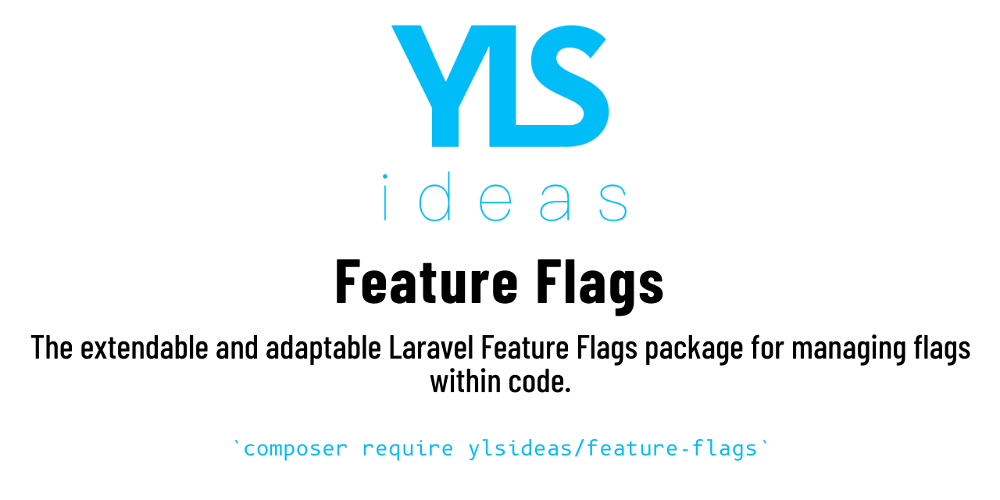

[](https://packagist.org/packages/ylsideas/feature-flags)
[](https://github.com/ylsideas/feature-flags/actions/workflows/run-tests.yml)
[](https://github.com/ylsideas/feature-flags/actions/workflows/pint.yml)
[](https://codecov.io/github/ylsideas/feature-flags)
[](https://packagist.org/packages/ylsideas/feature-flags)
[](https://github.com/sponsors/peterfox)

A Feature flag is at times referred to as a feature toggle or feature switch. Ultimately it's a coding strategy 
to be used along with source control to make it easier to continuously integrate and deploy. The idea of 
the flags works by essentially safe guarding sections of code from executing if a feature flag isn't in a switched 
on state.

This package aims to make implementing such flags across your application a great deal easier by providing solutions
that work with not only your code but your routes, blade files, task scheduling and validations.

## The Feature flagging dashboard for Laravel

[](https://www.flagfox.dev/?utm_campaign=waitlist&utm_source=github&utm_content=featureflags)

In late 2022 we decided to start work on a dashboard that will work on top of all the awesomeness that [Feature flags 
for Laravel](https://github.com/ylsideas/feature-flags) gives you. Right now you can 
[join the waiting list](https://www.flagfox.dev/?utm_campaign=waitlist&utm_source=github&utm_content=featureflags#waitlist).

## How adding feature flags looks with this package

It's pretty simple, you can start of with just simple calls to check if a flag's state is on or off.

```php
Features::accessible('my-feature') // returns true or false
```

One of the unique features of this package is that it integrates heavily into Laravel by allowing you to 
configure different things such as access to route, schedule tasks or modifying the query builder.

To get a full understanding, it's best to [read the docs](https://feature-flags.docs.ylsideas.co/).

## Upgrading

Version 3 and 2 are mostly the same. Some additonal type hinting was adding but not no major
upgrade work should be required.

Version 2 and is somewhat different to version 1. If you are using Laravel 9 and PHP8
you should aim to use version 2. Version 1 is no longer supported. There is an [upgrade guide for moving
from version 1 to version 2](UPGRADE.md).

## Installation

You can install the package via composer:

```bash
composer require ylsideas/feature-flags:^3.0
```

Once installed you should publish the config with the following command.

```bash
php artisan vendor:publish --provider="YlsIdeas\FeatureFlags\FeatureFlagsServiceProvider" --tag=config
```

You can customise the `features.php` config in a number of ways.

## Documentation

For the complete documentation, visit [https://feature-flags.docs.ylsideas.co/](https://feature-flags.docs.ylsideas.co/).

## Package Development

If you wish to develop new features for this package you may run the tests using the following command.

``` bash
composer test
```

Make sure any code you work on is linted as well.

```bash
composer lint
```

and that the code doesn't introduce errors with PHPStan.

```bash
composer analyse
```

Please make sure you *follow the Pull Request template* for all proposed changes. Ignoring it
will mean the PR will be ignored.

### Changelog

Please see [CHANGELOG](CHANGELOG.md) for more information what has changed recently.

## Contributing

Please see [CONTRIBUTING](CONTRIBUTING.md) for details.

### Security

If you discover any security related issues, please email peter.fox@ylsideas.co instead of using the issue tracker.

## Credits

- [Peter Fox](https://github.com/ylsideas)
- [All Contributors](../../contributors)

## License

The MIT License (MIT). Please see [License File](LICENSE.md) for more information.
